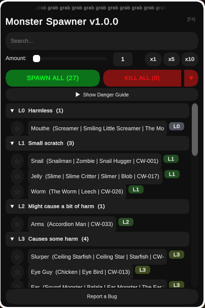

# Monster Spawner

> Spawn **every monster** in Content Warning at your fingertips — search, favorites, and a danger guide built in.

A **BepInEx plugin** for [Content Warning](https://store.steampowered.com/app/2881650/Content_Warning/) that lets you spawn every monster in the game with a searchable, favorite-able GUI. Fully host-only so it stays fair — vanilla players never see the mod doing anything weird.

---

## Screenshots

| **Spawner Menu** |
|:---:|
|  |

---

## Quick Start

1. Install [BepInEx for Content Warning](https://thunderstore.io/c/content-warning/p/BepInEx/BepInExPack/)
2. Download `MonsterSpawnerMod.dll` from [Thunderstore](https://thunderstore.io/c/content-warning/p/eliteghg/MonsterSpawnerMod/)
3. Copy to `BepInEx/plugins/`
4. Launch Content Warning and press **F4** to open the menu

---

## Features

- **27 monsters** — the full bestiary in wiki (CW-number) order with wiki danger levels L0–L10
- **Search** — filter by name, alias, or ID instantly
- **Favorites** — star your go-to monsters, saved between sessions
- **Recent** — quick access to your last 8 spawns
- **Amount slider** — spawn 1–50 at once, plus x1 / x5 / x10 presets
- **Spawn All** — batch-spawn every filtered monster (staggered, capped at 120 for performance)
- **Kill All + per-monster Kill** — wipe everything with confirmation, or pick targets from the scrollable Spawned panel with MOD/VANILLA and danger badges
- **Danger Guide** — color-coded legend from L0 (Harmless) to L10 (Death Is Almost Certain), matching the wiki
- **Input freeze** — game camera, clicks and hotkeys stay dormant while the menu is open
- **Bug Reporting** — report popup with Title/Description/Steps; system info + logs auto-copy to clipboard, optional GitHub auto-open
- **Host-only** — clients can't spawn, keeps things fair

---

## Keybind

Press **F4** to open/close the spawner menu (rebindable in the config file).

Only the **host** can use the spawner.

---

## Monster List & Danger Levels

| Level | Meaning |
|-------|---------|
| L0 | Harmless |
| L1 | Small scratch |
| L2 | Might cause a bit of harm |
| L3 | Causes some harm |
| L4 | Eats your HP |
| L5 | Dangerous |
| L6 | Very Dangerous |
| L7 | Extremely Dangerous |
| L8 | Do not approach |
| L9 | You may be screwed |
| L10 | Death is almost certain |

Full list in wiki (CW-number) order:

| Monster | Danger | Aliases |
|---------|--------|---------|
| Streamer | L6 | CW-000 |
| Snail | L1 | Snailman, Zombie, Snail Hugger, CW-001 |
| Snatcho | L7 | Shadow Demon, Snatcher, Grabber Snake, Chokelegs, CW-002 |
| Whisk | L4 | Fan, Whisker, The Whisk, CW-003A |
| Big Slap | L10 | Titan, Tall Monster, Slapper, The Destroyer, CW-004 |
| Slurper | L3 | Ceiling Starfish, Ceiling Star, Starfish, CW-005 |
| Dog | L6 | Gun Dog, GunDog, A.S.T.R.A, Robot Attack Dog, Machine Gun Dog, CW-006 |
| Bomber | L5 | Bomb Bot, The Bomber Man, CW-007 |
| Knife Ghost | L5 | Knife, Ghost, Knifo, Knif, CW-008 |
| Spider | L4 | CW-009 |
| Mouthe | L0 | Screamer, Smiling Little Screamer, The Mouthe, CW-010 |
| Flicker | L9 | Jellyfish, The Flicker, CW-012 |
| Eye Guy | L3 | Chicken, Eye Bird, CW-013 |
| Weeping | L7 | Maiden, Iron Maiden, The Weeping, Cage, CW-014 |
| Ear | L3 | Sound Monster, Balala, Ear Monster, The Ear, CW-016 |
| Jelly | L1 | Slime, Slime Critter, Slimer, Blob, CW-017 |
| Harpooner | L7 | Hookman, Harpoon, CW-020 |
| Cam Creep | L6 | Camera Monster, The Creep, CW-022 |
| Puffo | L3 | Blowfish, Babushka, Puff Ball, CW-023 |
| Mime | L4 | Blinking Waldo, CW-024 |
| Robot Button | L5 | Explosive Button, Button, CW-025 |
| Worm | L1 | The Worm, Leech, CW-026 |
| Fire Monster | L6 | Fire, Turtle, Fire Beast, Flame Turtle, Fire Horse, Bowser, Godzilla, Firebreather, CW-027 |
| Black Hole Bot | L4 | Drone, Gravity Monster, Black Hole Drone, CW-029 |
| Ultra Knifo | L6 | Big Knifo, Knifo EX, Grown-Up Knife Ghost, CW-030 |
| Snail Spawner | L6 | Giant Slug, Slug, CW-031 |
| Arms | L2 | Accordion Man, CW-033 |

The ??? rows are unused/cut-content entities (Angler, Bites, toolkit variants). They have no prefab in the game's Resources and **cannot be spawned** — the mod shows them with a "No prefab" label for reference. Barnacle, Snatcher, Infiltrator and Shroomer have no known spawn IDs and are not included.

---

## Installation

1. Install [BepInEx for Content Warning](https://thunderstore.io/c/content-warning/p/BepInEx/BepInExPack/)
2. Download `MonsterSpawnerMod.dll` from [Thunderstore](https://thunderstore.io/c/content-warning/p/eliteghg/MonsterSpawnerMod/)
3. Copy `MonsterSpawnerMod.dll` to `BepInEx/plugins/`
4. Launch the game and press **F4**

---

## Configuration

Edit your `BepInEx/config/com.monsterspawner.gui.cfg` file:

- **ToggleKey** — the key that opens/closes the menu (default: `F4`)
- **CloseOnEsc** — also close the menu with Escape (default: `false`)

---

## Compatibility

- **Host-only** — only the host spawns; clients are unaffected
- **Vanilla-safe** — spawned monsters use the game's own spawning system

---

## Bug Reports

Press **Report** in the mod menu — fill in Title, Description and Steps to Reproduce, then **SUBMIT REPORT**. Your system info, mod version, mod state and log tail are copied to clipboard automatically, and the issue page opens on GitHub (toggleable) with the title pre-filled. Just paste and submit.

Or report directly: [GitHub Issues](https://github.com/EliteXGHG/MonsterSpawner-Content-Warning/issues)

Or message me on Discord: 
